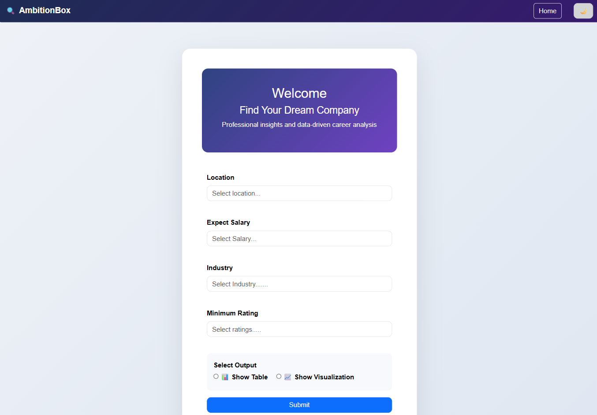
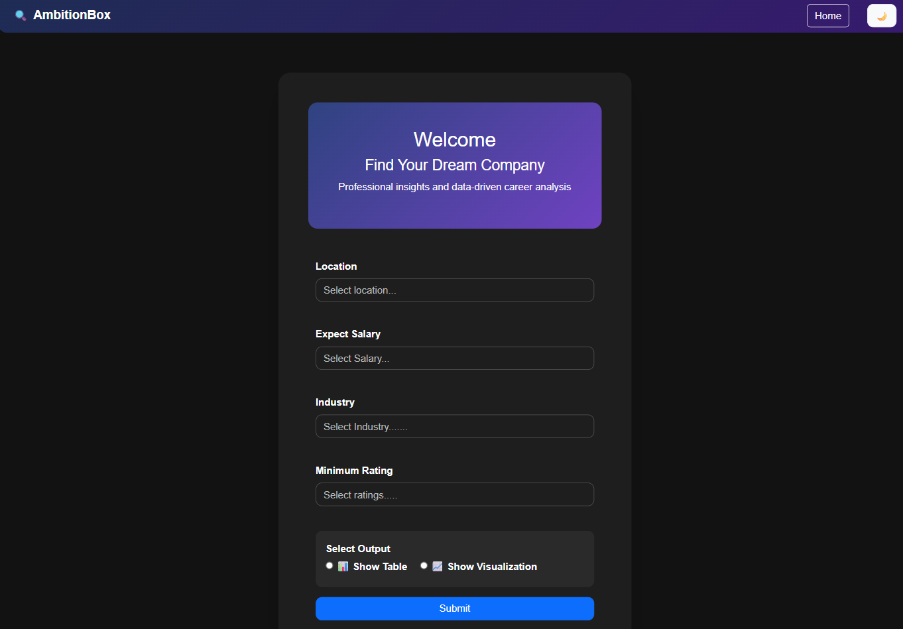
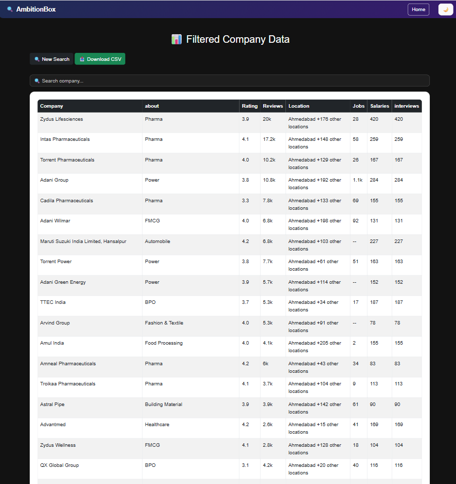
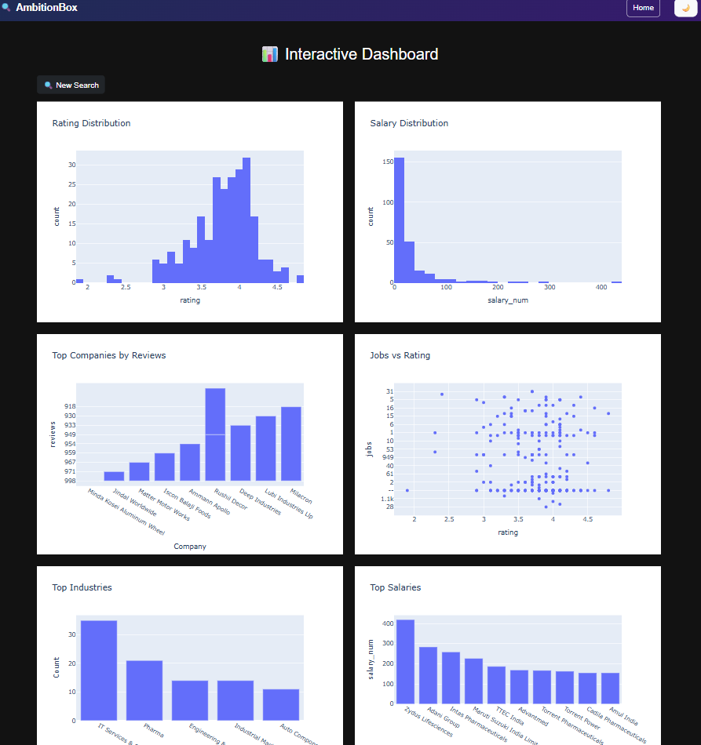

# 🚀 AmbitionBox Job Analysis

A Flask-based web application that allows users to explore, filter, and analyze companies based on salary, ratings, location, and industry using real-world data.

---

## 🌟 Features

* 🔍 Filter companies by:

  * Location
  * Expected Salary
  * Industry
  * Minimum Rating

* 📊 Output Options:

  * Table View
  * Interactive Visualizations

* 🌙 Dark Mode Support

* 📥 Download filtered data as CSV

---

## 🛠️ Tech Stack

* **Backend:** Flask (Python)
* **Frontend:** HTML, CSS, Bootstrap
* **Data Processing:** Pandas, NumPy
* **Visualization:** Plotly

---

## 📸 Screenshots

### 🏠 Home Page (Light Mode)



### 🌙 Home Page (Dark Mode)



### 📊 Results Table



### 📈 Visualization Dashboard




---

## ⚙️ Installation & Setup

```bash
git clone https://github.com/rohit33-code/ambitionbox-job-analysis.git
cd ambitionbox-job-analysis
pip install -r requirements.txt
python app.py
```

Open browser:

```
http://127.0.0.1:5000
```

---

## 📁 Project Structure

```
ambitionbox-job-analysis/
│
├── app.py
├── templates/
│   ├── base.html
│   ├── index.html
│   ├── results.html
│   ├── visuals.html
│
├── static/
│   └── css/
│       └── style.css
│
├── screenshorts/
├── ambitionbox_companies.csv
└── README.md
```

---

## 💡 Future Improvements

* 🔐 User authentication system
* 📊 Advanced filters
* 📱 Mobile responsiveness improvements

---

## 👨‍💻 Author

**ROHIT SHARMA**
🚀 Aspiring Data Scientist | ML Engineer

---

## ⭐ Support

If you like this project, give it a ⭐ on GitHub!
